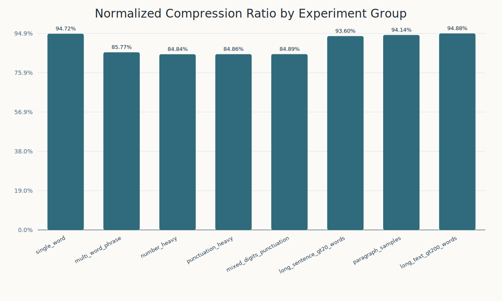
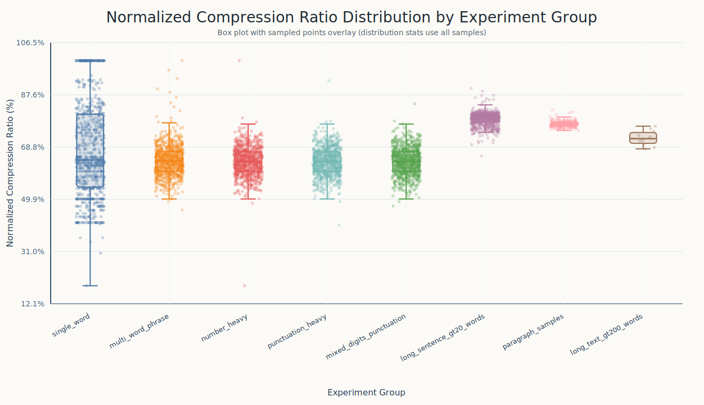

[](README.md)
[](README.zh-CN.md)

# Morse Code Simplify

**Please note, this is an experimental algorithm**

**AI Iterative Testing Repository Based on [MorseFold](https://github.com/qingchenyouforcc/MorseFold)**

A reversible lightweight compression experiment for Morse code sequences: text is first converted into standard Morse code, then transformed into a shorter simplified representation using consecutive equal-length grouping, alternating-pattern detection, compact meta tokens, and message-local repeated-word references, while still supporting full decoding back to the original text.

## Abstract

This project studies a narrow but practical question: although standard Morse code is already a discrete symbol sequence, it still contains visible structural redundancy at the character level, including repeated length patterns, dot-dash bias, fully alternating structures, and repeated words inside the same message. Based on these properties, the project implements a reversible simplification method. Rather than pursuing globally optimal compression, it applies local structural rules, compact tokenization, and a message-local back-reference layer, with a fallback policy that keeps the raw Morse group whenever simplification is not shorter.

From the current implementation and benchmark outputs in this repository, the method produces consistent character-level savings across single words, phrases, long sentences, paragraphs, and long texts. The implementation uses only the Python standard library, which makes it suitable for teaching demos, small research prototypes, and further algorithm iteration.

## Problem Statement

Standard Morse code has two direct limitations in this context:

- It was designed for transmission robustness, not text compression.
- Even though each symbol is small, total encoded length still grows quickly for long texts.

This project tries to answer two questions:

1. Can standard Morse code be structurally simplified without losing reversibility?
2. Can that simplification produce stable character-level gains across different text scales?

## Method

The core implementation is [`encoder.py`](encoder.py), specifically `text_to_morseSimplify()`. The current pipeline is:

1. Convert plain text to standard Morse code with [`main.py`](main.py) and `text_to_morse()`.
2. Inside each word, split the Morse stream into groups of consecutive codes with the same length.
3. For each same-length run, search for the shortest mix of raw output and compressed subsegments.
4. Convert Morse codes in compressed segments into compact identifiers `ID`.
5. Encode the group rule symbol `RS` with a single-character token.
6. If the compressed group is not shorter than the raw group, keep the raw Morse group.
7. After each word is simplified, optionally replace repeated words within the same message by a short `~<index>` reference when that is shorter.
8. Emit a reversible simplified string.

### Grouping Rule

Inside each word, grouping is based on consecutive Morse codes with identical length. For example:

```text
.... . .-.. .-.. ---
```

is split into:

```text
.... | . | .-.. .-.. | ---
```

Only consecutive codes with the same length can belong to the same group.

### RS Symbol

Each candidate compressed segment has a logical `RS` value with the form `<length><tail>`, for example `4-` or `3.`.

Where:

- `length` is the Morse length shared by all codes in the group.
- `tail` is the group bias symbol.

The bias is computed as follows:

- If a Morse code has at least as many `-` as `.`, it is marked as `1`.
- If it has more `.` than `-`, it is marked as `0`.
- If the code is strictly alternating, it is handled as a special regular case.
- The encoder compares both `tail = -` and `tail = .` directly and keeps the shorter result.

In the current format, this logical `RS` value is stored as a single token:

- `G -> 4-`
- `H -> 4.`
- `J -> 5.`

[`decoder.py`](decoder.py) still supports the earlier `%RS` form for backward compatibility.

### ID Encoding

After `RS` is determined, each Morse code in the group is converted into an `ID`:

- If `RS` ends with `-`, record the positions of `.`.
- If `RS` ends with `.`, record the positions of `-`.
- Positions are 1-based.
- Multiple positions are concatenated directly as a string.
- In the current format, common `ID` strings are further mapped to single-character tokens.

For example, in a `4-` group:

- `--.- -> 3`
- `---- -> ""`

And in the compact token layer:

- `3 -> d`
- `+ -> b`
- `"" -> a`

### Alternating Structure

If a Morse code contains no adjacent repeated symbol from start to end, it is treated as a regular alternating code:

- Codes starting with `-` are encoded as `+`
- Codes starting with `.` are encoded as `-`

For example:

- `-.-. -> +`
- `.-.- -> -`

### Reversible Output Format

The simplified output has the logical form:

```text
ID\ID\...%RS|raw_group|ID\ID\...%RS/...
```

Separators:

- `\`: separates multiple `ID` values inside one compressed group
- `%`: separates `ID` data from `RS`
- `|`: separates groups inside one word
- `/`: separates words

The current encoder may emit more compact forms:

- compact group form: `fbG`
- mixed raw/compressed word form: `....|.|eeH|---`
- repeated-word reference form: `~0`

So the practical current output is better described as:

```text
compact_group|raw_group|compact_group/.../~index
```

This format is fully decoded by [`decoder.py`](decoder.py) back into standard Morse code and then plain text. The decoder is backward-compatible with the earlier `%RS` and backslash-separated forms.

### Message-Local Repeated Word Reference

After a word has been simplified, the encoder may reuse it later in the same message.

- The first occurrence is emitted normally.
- Later identical simplified words can be replaced by `~<index>`.
- The index uses `0-9a-zA-Z`.
- A reference is only used if it is shorter than the original simplified word.

This is a message-local reversible back-reference, not a static dataset-tuned dictionary.

### Fallback Strategy

This is one of the main engineering constraints in the current implementation:

```text
if len(encoded_group) >= len(raw_group):
    keep raw_group
```

So the algorithm is not a forced compression scheme. It only compresses when the result is actually shorter.

## Example

### Example A

Input text:

```text
QC
```

Standard Morse code:

```text
--.- -.-.
```

Simplified encoding:

```text
fbG
```

Explanation:

- Both characters have length `4`, so they form one group.
- The logical group bias becomes `4-`, whose current token is `G`.
- In `--.-`, the dot is at position `3`, which maps to token `f`.
- `-.-.` is a regular alternating code, so its identifier is `+`, which maps to token `b`.

### Example B

Input text:

```text
HELLO WORLD
```

Standard Morse code:

```text
.... . .-.. .-.. --- / .-- --- .-. .-.. -..
```

Simplified encoding:

```text
....|.|eeH|---/dacE|.-..|-..
```

This shows that simplification is not applied uniformly character by character. Each candidate group inside a word is evaluated independently, so some groups are compressed and others remain raw.

### Example C

Input text:

```text
HELLO HELLO
```

Standard Morse code:

```text
.... . .-.. .-.. --- / .... . .-.. .-.. ---
```

Simplified encoding:

```text
....|.|eeH|---/~0
```

This demonstrates the current repeated-word reference rule: the second `HELLO` is replaced by `~0`, which points to the first simplified word in the same message.

## Demo

### 1. Text Encoding Demo

```powershell
python main.py
```

The program prints:

- Standard Morse code
- Simplified encoding
- Both lengths
- Character reduction
- Compression ratio

### 2. Simplified-Code Decoding Demo

```powershell
python decoder.py
```

The program prints:

- Decoded standard Morse code
- Decoded plain text

### 3. Python API Demo

```python
from main import text_to_morse
from encoder import text_to_morseSimplify
from decoder import simplified_to_morse, simplified_to_text

text = "HELLO WORLD"
morse = text_to_morse(text)
simplified = text_to_morseSimplify(morse)

print(morse)
print(simplified)
print(simplified_to_morse(simplified))
print(simplified_to_text(simplified))
```

## Experimental Setup

Benchmark scripts are under [`benchmarks/`](benchmarks/):

- [`benchmarks/benchmark_experiments.py`](benchmarks/benchmark_experiments.py): unified experiment entry point, generates summary CSV files
- [`benchmarks/visualize_results.py`](benchmarks/visualize_results.py): converts CSV outputs into SVG charts
- [`benchmarks/benchmark_dataset.py`](benchmarks/benchmark_dataset.py): base-sample statistics
- [`benchmarks/benchmark_long_sentences.py`](benchmarks/benchmark_long_sentences.py): long-sentence statistics
- [`benchmarks/benchmark_paragraphs.py`](benchmarks/benchmark_paragraphs.py): paragraph statistics
- [`benchmarks/benchmark_long_texts.py`](benchmarks/benchmark_long_texts.py): long-text statistics

Datasets are stored under [`datasets/`](datasets/):

- `base`: short baseline samples
- `long`: long-sentence samples
- `paragraph`: paragraph samples
- `long_text`: extra-long text samples

Run:

```powershell
python benchmarks/benchmark_experiments.py
python benchmarks/visualize_results.py
```

Outputs are written to [`output/`](output/).

## Results Overview

The following numbers come from the current repository output file [`output/experiment_group_summary.csv`](output/experiment_group_summary.csv), regenerated with the current implementation.

| Group | Samples | Compression Ratio | Normalized Compression Ratio | Total Reduction |
| --- | ---: | ---: | ---: | ---: |
| single_word | 10000 | 65.62% | 65.62% | 104753 |
| multi_word_phrase | 10000 | 59.77% | 63.64% | 332554 |
| number_heavy | 10000 | 59.57% | 63.43% | 336266 |
| punctuation_heavy | 10000 | 59.57% | 63.43% | 336408 |
| mixed_digits_punctuation | 10000 | 59.57% | 63.43% | 336410 |
| long_sentence_gt20_words | 1000 | 72.44% | 78.86% | 170942 |
| paragraph_samples | 200 | 69.96% | 77.07% | 84327 |
| long_text_gt200_words | 10 | 65.34% | 71.99% | 12135 |

Notes:

- Lower `Compression Ratio` is better; it means the simplified representation occupies a smaller fraction of the original Morse string.
- `Normalized Compression Ratio` removes the formatting advantage of replacing `" / "` with `"/"`, so it better isolates the algorithmic gain.

From the current results:

- Single words and structured short samples show the strongest normalized gains because compact `ID` and `RS` tokens amortize well.
- Multi-word and long-text groups still keep clear positive savings, which indicates that the current format scales beyond toy examples.
- Repeated words inside the same message can now be folded by `~<index>` references, which the current encoder and decoder both support.

## Visualization

### Compression Ratio by Group



### Distribution by Group



### Sample-Level Trend


These charts are suitable for reports, demos, presentations, or a repository landing page.

## Code Organization

```text
morsecode_simplify/
├─ main.py
├─ encoder.py
├─ decoder.py
├─ benchmarks/
├─ datasets/
└─ output/
```

Module roles:

- [`main.py`](main.py): plain text to standard Morse code; CLI encoding entry point
- [`encoder.py`](encoder.py): standard Morse code to simplified encoding
- [`decoder.py`](decoder.py): simplified encoding back to Morse code and plain text
- [`benchmarks/`](benchmarks/): experiment statistics and chart generation

## Engineering Rules Observed in Code

The current codebase follows these visible implementation conventions:

- Python standard library only, with no third-party dependencies
- Public functions validate `str` inputs
- Invalid inputs raise `TypeError` or `ValueError`
- Type annotations are used throughout
- Files are read with `utf-8`
- Benchmark scripts use `pathlib.Path`
- Both CLI usage and module import usage are supported

## Limitations

The current method still has clear boundaries:

- Compression is still mainly driven by local groups plus message-local repeated-word reuse, not globally optimal parsing
- The supported character set is mainly English letters, digits, and common English punctuation
- Gains can be limited for irregular Morse sequences with little repeated local structure
- `ID` values are compacted, but longer Morse lengths can still leave residual metadata overhead
- Evaluation currently focuses on character length, not stricter information-theoretic metrics

## Future Work

Possible next steps include:

- stronger reuse across segments instead of only same-word groups and repeated-word references
- more general message-level template reuse without dataset-specific tuning
- a more compact scheme for low-frequency `ID` patterns that still fall back to multi-character forms
- systematic comparisons against alternatives such as RLE-style or Huffman-style approaches
- more formal metrics such as entropy estimates, decoding complexity, and throughput

## Optimization Notes

The current repository state includes six documented optimization rounds in [`LOG.md`](LOG.md):

- Optimization #1: shortest segmentation search inside same-length runs
- Optimization #2: caching and incremental DP construction
- Optimization #3: enable length-1 and length-2 runs to participate in shortest-form search
- Optimization #4: single-character `RS` tokens
- Optimization #5: compact single-character `ID` tokens
- Optimization #6: message-local repeated-word references with `~<index>`

## Environment

- Python 3.10+

## Reproducibility

The current repository supports the full round trip:

```text
text -> morse -> simplified -> morse -> text
```

Using the included datasets and scripts, the project can reproduce benchmark CSV files and SVG charts directly. That makes it suitable for:

- algorithm coursework
- small paper prototypes
- encoding-rule demos
- GitHub project showcases
